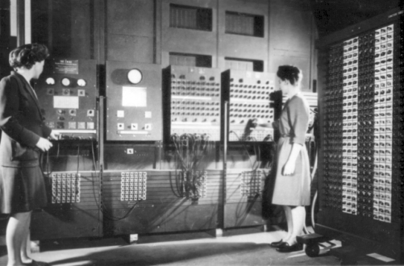
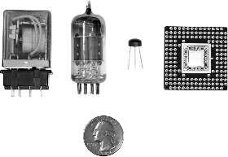
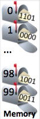

# What is a computer?

## Switches

When people in the 1800s began using electricity for lights and machines, they created switches to turn objects on and off. A switch controls whether or not electricity flows through a wire. In the early 1900s, people created special switches that could be controlled electronically, rather than by a person moving the switch up or down. In an electronically controlled switch, a positive voltage at the control input allows electricity to flow, while a zero voltage prevents the flow. Such switches were useful, for example, in routing telephone calls. Engineers soon realized they could use electronically controlled switches to perform simple calculations. The engineers treated a positive voltage as a "1" and a zero voltage as a "0". 0s and 1s are known as bits (binary digits). They built connections of switches, known as circuits, to perform calculations such as multiplying two numbers.

These circuits became increasingly complex, leading to the first electronic computers in the 1930s and 1940s, consisting of about ten thousand electronic switches and typically occupying entire rooms as in the above figure. Early computers performed thousands of calculations per second, such as calculating tables of ballistic trajectories.

## Processors and memory

To support different calculations, circuits called processors were created to process (aka execute) a list of desired calculations, with each calculation called an instruction. The instructions were specified by configuring external switches, as in the figure above. Processors used to take up entire rooms but today fit on a chip about the size of a postage stamp, containing millions or even billions of switches.

Instructions are stored in a memory. A memory is a circuit that can store 0s and 1s in each of a series of thousands of addressed locations, like a series of addressed mailboxes that each can store an envelope (the 0s and 1s). Instructions operate on data, which is also stored in memory locations as 0s and 1s.

Thus, a computer is basically a processor interacting with a memory, as depicted in the following example. In the example, a computer's processor executes program instructions stored in memory, also using the memory to store temporary results. The example program converts an hourly wage ($20/hr) into an annual salary by multiplying by 40 (hours/week) and then by 52 (weeks/year), outputting the final result to the screen.

1. The processor computes data, while the memory stores data (and instructions).
2. Previously computed data can be read from memory.
3. Data can be output to the screen.

The arrangement is akin to a chef (processor) who executes instructions of a recipe (program), each instruction modifying ingredients (data), with the recipe and ingredients kept on a nearby counter (memory).

## Instructions

Below are some sample types of instructions that a processor might be able to execute, where X, Y, Z, and num are each an integer.

- Table 1.5.1: Sample processor instructions
  - Add X, #num, Y:
    - Adds data in memory location X to the number num, storing result in location Y.
  - Sub X, #num, Y:
    - Subtracts num from data in location X, storing result in location Y.
  - Mul X, #num, Y:
    - Multiplies data in location X by num, storing result in location Y.
  - Div X, #num, Y:
    - Divides data in location X by num, storing result in location Y.
  - Jmp Z:
    - Tells the processor that the next instruction to execute is in memory location Z.

For example, the instruction "Mul 97, #9, 98" would multiply the data in memory location 97 by the number 9, storing the result into memory location 98. So if the data in location 97 were 20, then the instruction would multiply 20 by 9, storing the result 180 into location 98. That instruction would actually be stored in memory as 0s and 1s, such as "011 1100001 001001 1100010", where 011 specifies a multiply instruction and 1100001, 001001, and 1100010 represent 97, 9, and 98 (as described previously). The following animation illustrates the storage of instructions and data in memory for a program that computes F = (9*C)/5 + 32, where C is memory location 97 and F is memory location 99.

1. Memory stores instructions and data as 0s and 1s.
2. The material will commonly draw the memory with the corresponding instructions and data to improve readability.

The programmer-created sequence of instructions is called a program, application, or just app.

When powered on, the processor starts by executing the instruction at location 0, then location 1, then location 2, etc. The above program performs the calculation over and over again. If location 97 is connected to external switches and location 99 to external lights, then the computer programmer (like the women operating the ENIAC computer in the earlier picture) could set the switches to represent a particular Celsius number, and the computer would automatically output the Fahrenheit number using the lights.

1. The processor starts by executing the instruction at location 0.
2. The processor next executes the instruction at location 1, then location 2. 'Next' keeps track of the location of the next instruction.
3. The Jmp instruction indicates that the next instruction to be executed is at location 0, so 0 is assigned to 'Next'.
4. The processor executes the instruction at location 0, performing the same sequence of instructions over and over again.

## Writing computer programs

In the 1940s, programmers originally wrote each instruction using 0s and 1s, such as "001 1100001 001001 1100010". Instructions represented as 0s and 1s are known as machine instructions, and a sequence of machine instructions together form an executable program (sometimes just called an executable). Because 0s and 1s are hard to comprehend, programmers soon created programs called assemblers to automatically translate human readable instructions, such as "Mul 97, #9, 98", known as assembly language instructions, into machine instructions. The assembler program thus helped programmers write more complex programs.

In the 1960s and 1970s, programmers created high-level languages to support programming using formulas or algorithms, so a programmer could write a formula like: F = (9 / 5) * C + 32. Early high-level languages included FORTRAN (for "Formula Translator") or ALGOL (for "Algorithmic Language"), which were more closely related to how humans thought than were machine or assembly instructions.

To support high-level languages, programmers created compilers, which are programs that automatically translate high-level language programs into executable programs.

1. A programmer writes a high-level program.
2. The programmer runs a compiler, which converts the high-level program into an executable program.
3. Users can then run the executable.

Using the above approach, an executable can only run on a particular processor type (like an x86 processor); to run a program on multiple processor types, the programmer must have the compiler generate multiple executables. Some newer high-level languages like Java use an approach that allows the same executable to run on different processor types. The approach involves having the compiler generate an executable using machine instructions of a "virtual" processor; such an executable is sometimes called bytecode. Then, the real processor runs a program, sometimes called a virtual machine, that executes the instructions in the bytecode. Such an approach may yield slower program execution, but has the advantage of portable executables.
